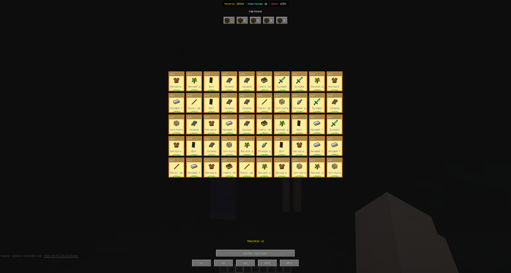
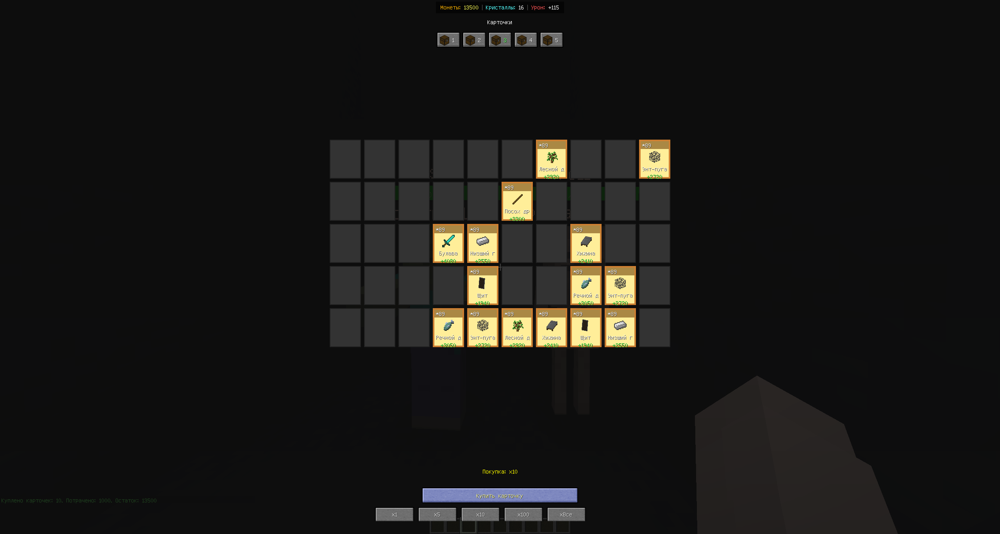
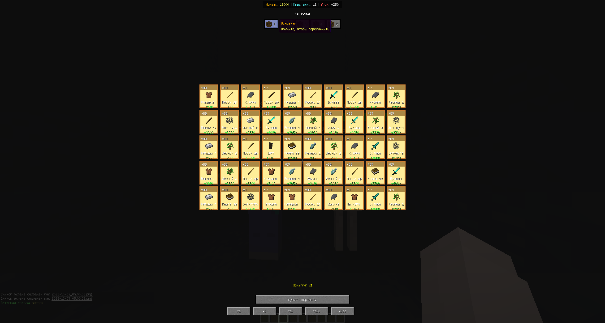
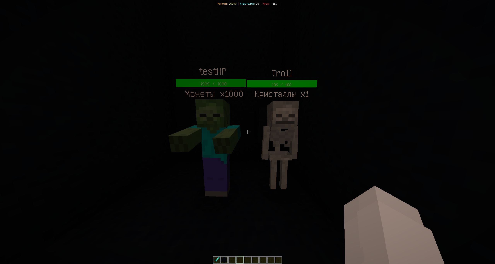

# Custom GUI Mod — Forge 1.12.2

Портфолио-проект игрового режима для Minecraft 1.12.2 с кастомным GUI, карточками, колодами, кастомными мобами, ресурсами и хранением данных в MongoDB.

Проект построен на Forge Dedicated Server и использует единый клиент-серверный мод.

**Текущая версия: `v1.1.0`**

---

## 🎯 Что реализовано

- кастомный GUI карточек на 50 слотов;
- несколько независимых колод;
- переключение колод прямо из GUI;
- покупка карточек `x1`, `x5`, `x10`, `x100`, `xВсе`;
- бонус урона от всех сохранённых карточек;
- постоянный HUD: монеты, кристаллы и общий бонус урона;
- кастомные Zombie и Skeleton;
- собственные HP-полоски над мобами;
- разные ресурсы-награды для разных мобов;
- создание пользовательских ресурсов через команды;
- быстрое возрождение кастомных мобов;
- отключение ванильного дропа;
- защита кастомных мобов от внешних источников урона;
- MongoDB-хранение игроков, колод, карточек, мобов и ресурсов;
- умное Tab-автодополнение команд с фильтрацией по введённому префиксу.

---

## 🛠️ Технологический стек

| Компонент | Технология |
|---|---|
| Язык | Java 8 |
| Minecraft | 1.12.2 |
| Forge | 14.23.5.2859 |
| Gradle | 7.6.4 |
| ForgeGradle | 5.1.73 |
| MongoDB | 5.0.34 |
| MongoDB Driver | 4.5.1 |
| Сеть | `SimpleNetworkWrapper` |

---

## 🎴 Карточки и GUI

GUI открывается клавишей `C` и содержит сетку из **50 слотов (10 × 5)**.

Карточки имеют разные типы, иконки, характеристики и стоимость. Покупка поддерживает несколько режимов:

```text
x1
x5
x10
x100
xВсе
```

Сервер сам определяет доступное количество покупок с учётом баланса и свободных слотов.



### Массовая покупка

При массовой покупке несколько карточек добавляются за одно действие, а баланс и бонус урона обновляются сразу.



---

## 🗂️ Колоды

Игрок может иметь несколько независимых колод.

Для каждой колоды отдельно сохраняются:

- название;
- карточки;
- занятые и свободные слоты.

Активную колоду можно переключать как командой, так и непосредственно в GUI через верхний селектор.

Бонус урона при этом считается **по карточкам из всех колод**, а не только по активной.



---

## ⚔️ Бонус урона

Каждая сохранённая карточка добавляет:

```text
+1 damage
```

Сервер суммирует карточки во всех колодах игрока и применяет бонус через Forge-событие урона.

Кастомные мобы не используют ванильную броню, поэтому итоговый урон соответствует рассчитанному бонусу.

---

## 📊 HUD игрока

В верхней части экрана постоянно отображаются:

```text
Монеты | Кристаллы | Урон
```

HUD обновляется сервером после изменений игровых данных.

---

## 👾 Кастомные мобы

Поддерживаются:

- Zombie;
- Skeleton.

Для каждого моба настраиваются:

- имя;
- ресурс награды;
- количество ресурса;
- максимальное HP;
- тип;
- точка спавна.

Мобы:

- не используют AI;
- не перемещаются;
- имеют фиксированную точку спавна;
- быстро возрождаются после смерти;
- не выбрасывают ванильный дроп;
- защищены от лавы, огня, TNT и других внешних источников урона;
- получают урон от игрока.

Над каждым мобом отображаются имя, текущее HP, максимальное HP и награда.



---

## 💎 Система ресурсов

Встроенные ресурсы:

```text
coins
crystals
lightnings
```

Дополнительные ресурсы можно создавать через `/customresource`.

Каждому кастомному мобу при создании назначается конкретный ресурс и его количество. Например, один моб может выдавать монеты, а другой — кристаллы.

Для старых мобов без сохранённого поля ресурса используется совместимость с прежней монетной наградой.

---

## 💻 Команды

### Мобы

```text
/custommob create <name> <resource> <amount> <hp> <type>
/custommob setspawn <name>
/custommob unspawn <name>
/custommob delete <name>
/custommob list
```

Поддерживаемые типы мобов:

```text
zombie
skeleton
```

### Ресурсы

```text
/customresource create <name>
/customresource delete <resource>
/customresource list
/customresource balance <resource>
```

### Колоды

```text
/customdeck create <name>
/customdeck switch <index>
/customdeck list
/customdeck delete <index>
```

Индексы колод начинаются с `0`.

### Карточки

```text
/customcards clear
```

Для всех пользовательских команд реализовано Tab-автодополнение. Оно учитывает уже введённый текст, поэтому, например:

```text
/custommob c<Tab>
```

предлагает `create`, а не перебирает команды с начала списка.

Для аргументов используются доступные значения там, где они известны: ресурсы, имена мобов, индексы колод и типы мобов.

---

## 🗄️ MongoDB

Используется база:

```text
cristalix_demo
```

Основные коллекции:

```text
players
custom_mobs
custom_resources
```

### players

Хранятся:

- UUID игрока;
- монеты;
- кристаллы;
- молнии;
- пользовательские ресурсы;
- активная колода;
- список колод;
- карточки каждой колоды.

### custom_mobs

Хранятся:

- имя;
- тип;
- HP;
- ресурс награды;
- количество награды;
- координаты;
- состояние точки спавна.

---

## 🌐 Клиент и сервер

```text
Forge Client
      ↕
SimpleNetworkWrapper
      ↕
Forge Dedicated Server
      ↕
MongoDB
```

Клиент отвечает в основном за GUI, HUD, рендер и ввод игрока.

Сервер является источником истины для баланса, карточек, колод, ресурсов, мобов, наград и расчёта урона.

---

## 🚀 Сборка

```bash
./gradlew clean build
```

JAR создаётся в:

```text
build/libs/customguimod-1.1.0.jar
```

Клиент и сервер должны использовать одинаковую версию мода.

---

## 📦 Версии

### v1.0.0

Первая публичная рабочая версия:

- кастомный GUI;
- карточки;
- базовые кастомные мобы;
- MongoDB;
- баланс и награды;
- клиент-серверный сетевой протокол.

### v1.0.1

- несколько колод;
- отдельное хранение карточек по колодам;
- бонус урона от карточек всех колод;
- исправление HP-полоски;
- отключение ванильного дропа;
- исправление дублирования мобов после рестартов;
- улучшение рендера кастомных мобов.

### v1.0.2

- переключение колод из GUI;
- улучшение управления активной колодой.

### v1.0.3

- массовая покупка карточек `x1/x5/x10/x100/xВсе`;
- корректная покупка с учётом баланса и свободных слотов.

### v1.0.4

- постоянный HUD `Монеты | Кристаллы | Урон`;
- обновление GUI карточек;
- синхронизация статистики игрока с сервером.

### v1.1.0

#### Добавлено

- настраиваемые ресурсы наград для мобов;
- команды управления кастомными ресурсами;
- возможность назначать отдельный ресурс награды каждому мобу;
- улучшенное Tab-автодополнение для кастомных команд;
- автодополнение с учётом уже введённого префикса;
- отображение ресурса и его количества над кастомными мобами.

#### Исправлено

- убрана ванильная броня у кастомных мобов;
- урон по кастомным мобам теперь корректно учитывает бонус урона от карточек.

#### Прочее

- добавлена обратная совместимость со старыми мобами, использующими награду в монетах;
- расширена структура MongoDB для кастомных ресурсов;
- обновлены скриншоты и документация проекта.

---

## 📸 Скриншоты

В README используются только актуальные скриншоты текущей версии. Устаревшие изображения удаляются, если соответствующая механика изменилась.

---

## 📄 License

См. файл [LICENSE](LICENSE).
