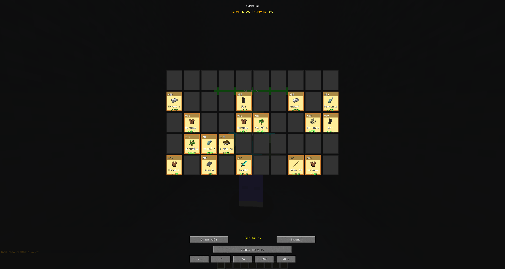
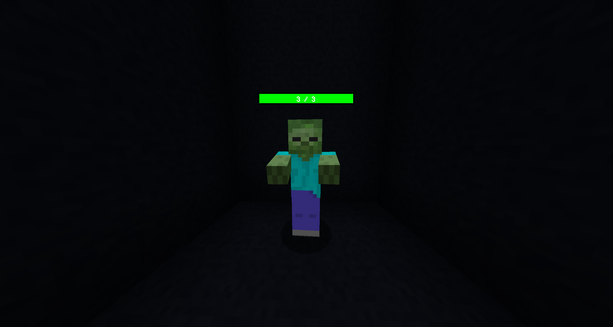
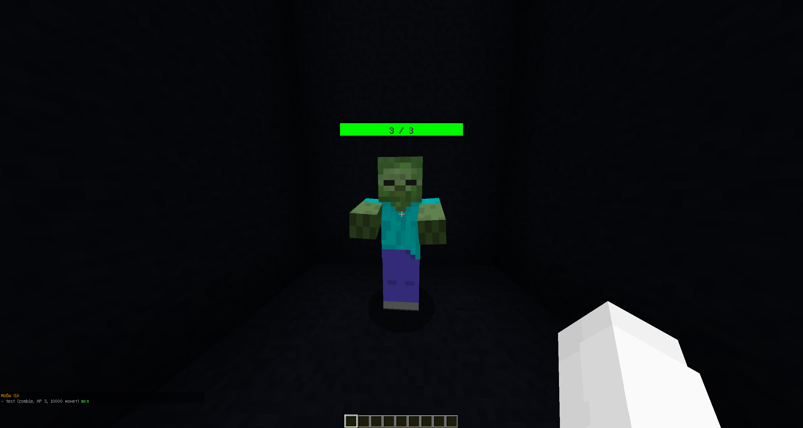
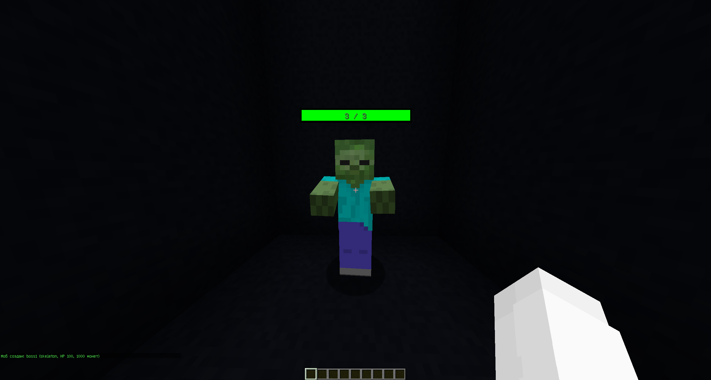
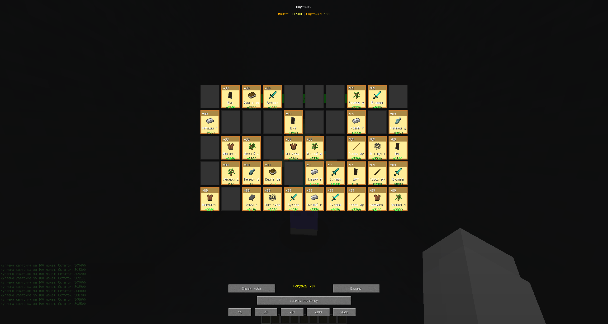

# Custom GUI Mod — Forge 1.12.2

Собственный игровой режим для Minecraft 1.12.2 с кастомным GUI, системой карточек и колод, MongoDB и двусторонним сетевым протоколом между клиентом и сервером.

Проект создаётся как портфолио-проект и вдохновлён архитектурой игровых режимов Cristalix.

**Текущая версия: `v1.0.1`**

---

## 🎯 О проекте

Проект демонстрирует разработку игрового режима для Minecraft с разделением клиентской и серверной логики:

- **Кастомный GUI** — собственный экран, а не стандартный Minecraft-сундук.
- **Система карточек** — покупка, хранение и влияние карточек на характеристики игрока.
- **Система колод** — несколько независимых наборов карточек для одного игрока.
- **Сетевой протокол** — двусторонняя связь клиент ↔ сервер через `SimpleNetworkWrapper`.
- **MongoDB** — хранение игроков, баланса, карточек, колод и кастомных мобов.
- **Кастомные мобы** — HP-полоски, награды, защита от внешнего урона и быстрый респавн.
- **Команды администратора** — создание и управление мобами и колодами.
- **Сохранение состояния** между перезапусками клиента и сервера.

---

## 🛠️ Технологический стек

| Компонент | Технология |
|---|---|
| Язык | Java 8 |
| Клиент | Forge 1.12.2 |
| Сервер | Forge 1.12.2 |
| Forge | 14.23.5.2859 |
| Сборка | Gradle 7.6.4 |
| ForgeGradle | 5.1.73 |
| База данных | MongoDB 5.0.34 |
| MongoDB Driver | 4.5.1 |
| IDE | IntelliJ IDEA |
| Дополнительные инструменты | Notepad++, PowerShell, MongoDB Compass |

---

## ✨ Что реализовано

### 🎴 Кастомный GUI

- Собственный `GuiScreen`.
- Сетка из **50 слотов (10 × 5)**.
- Три слоя карточек:
  - бронза;
  - серебро;
  - золото.
- Иконки предметов.
- Названия карточек.
- Статы.
- Уровень карточки.
- Tooltip при наведении.
- Анимация полёта карточки при покупке.
- Подсветка слотов.
- Открытие GUI по клавише `C` через `KeyBinding`.
- Очистка клиентских слотов перед загрузкой данных для предотвращения визуального дублирования.

В интерфейсе присутствуют кнопки:

- `x1`
- `x5`
- `x10`
- `x100`
- `xВсе`

Массовая покупка через `x5`, `x10`, `x100` и `xВсе` пока находится в разработке.

---

## 🗂️ Система колод

Игрок может иметь несколько независимых колод.

Реализовано:

- создание колоды;
- переключение активной колоды;
- удаление колоды;
- просмотр списка колод;
- отдельные карточки для каждой колоды;
- отдельные свободные слоты для каждой колоды;
- сохранение колод в MongoDB.

Пример структуры:

```text
Player
├── Deck 1
│   ├── Card
│   ├── Card
│   └── Card
│
├── Deck 2
│   ├── Card
│   └── Card
│
└── Deck 3
    └── Card
```

Активная колода используется для отображения и управления карточками в GUI.

---

## ⚔️ Система урона от карточек

Карточки увеличивают урон игрока.

Каждая сохранённая карточка добавляет:

```text
+1 damage
```

Бонус рассчитывается **по всем колодам игрока**, а не только по активной.

Пример:

```text
Колода 1: 5 карточек
Колода 2: 8 карточек
Колода 3: 2 карточки

Общий бонус: +15 урона
```

Переключение активной колоды не уменьшает общий бонус.

Расчёт выполняется сервером через `LivingHurtEvent`.

---

## 👾 Кастомные мобы

Реализованы кастомные:

- Zombie;
- Skeleton.

Мобы создаются сервером на основе данных из MongoDB.

### Поведение

- Не используют AI.
- Не перемещаются.
- Имеют фиксированную точку спавна.
- Имеют настраиваемое максимальное HP.
- Имеют настраиваемую награду.
- Быстро респавнятся после смерти.
- Респавн — примерно **0.5 секунды**.
- Имеют максимальное сопротивление отбрасыванию.

---

## ❤️ HP-полоска

Над кастомным мобом отображается собственная HP-полоска.

Полоска показывает **реальное текущее здоровье Entity**, а не сохранённое значение из MongoDB.

Пример:

```text
Zombie
██████████████
43 / 50
x50
```

Цвет полоски зависит от оставшегося здоровья:

- зелёный — больше 60%;
- жёлтый — больше 30%;
- красный — меньше 30%.

Также отображаются:

- имя моба;
- текущее HP;
- максимальное HP;
- размер награды.

Рендер выполняется через:

```java
RenderLivingEvent.Post
```

Для корректного восстановления OpenGL-состояния используются:

```java
GlStateManager.pushAttrib();
GlStateManager.popAttrib();
```

---

## 🛡️ Защита кастомных мобов

Кастомные мобы защищены от внешних источников урона.

Урон отменяется, если источник — не игрок.

Это защищает мобов от:

- лавы;
- огня;
- TNT;
- молнии;
- других внешних источников.

Игрок при этом может наносить им обычный урон.

---

## 🎁 Награды

После убийства кастомного моба игрок получает монеты.

Пример:

```text
+50 монет! Баланс: 350
```

Баланс:

- хранится в MongoDB;
- обновляется сервером;
- отправляется клиенту сетевым пакетом;
- сохраняется между сессиями.

---

## 🚫 Отключение ванильного дропа

Кастомные Zombie и Skeleton не выбрасывают стандартные Minecraft-предметы.

Например, с кастомного Zombie не выпадают:

- Rotten Flesh;
- Carrot;
- Iron Ingot;
- другие ванильные редкие дропы.

`LivingDropsEvent` определяет кастомного моба и очищает его физический дроп.

При этом серверная награда в виде монет продолжает работать независимо от ванильного дропа.

---

## 🔄 Защита от дублирования мобов

Minecraft сохраняет обычные Entity вместе с миром.

Из-за этого ранее после каждого перезапуска сервера мог появляться дополнительный экземпляр кастомного моба:

```text
Первый запуск  → 1 моб
Второй запуск → 2 моба
Третий запуск → 3 моба
```

Проблема исправлена.

При загрузке системы:

1. сервер находит старые сохранённые экземпляры кастомных мобов;
2. удаляет их из загруженного мира;
3. загружает точки спавна из MongoDB;
4. создаёт ровно по одному актуальному мобу на каждую точку.

После нескольких последовательных перезапусков на каждой точке остаётся только один моб.

---

## 🌐 Сетевой протокол

Используется:

```java
SimpleNetworkWrapper
```

Канал:

```text
customgui:main
```

Основные пакеты:

### `PingPacket`

Направление:

```text
Client → Server
```

Используется для действий игрока:

- покупка карточки;
- запрос баланса;
- загрузка карточек;
- другие GUI-действия.

### `PongPacket`

Направление:

```text
Server → Client
```

Используется для синхронизации баланса.

### `CardPacket`

Направление:

```text
Server → Client
```

Передаёт информацию о карточке:

- слот;
- индекс карточки;
- слой;
- необходимость проигрывания анимации.

Регистрация сетевых обработчиков разделена на клиентскую и серверную стороны.

---

## 🗄️ MongoDB

Используется база:

```text
cristalix_demo
```

### `players`

Пример структуры:

```javascript
{
    "_id": "player-uuid",
    "balance": 1000,
    "crystals": 0,
    "lightnings": 0,
    "activeDeck": 0,
    "decks": [
        {
            "name": "Main",
            "cards": [
                {
                    "slot": 0,
                    "cardIndex": 1,
                    "layer": 1,
                    "level": 1
                }
            ]
        }
    ]
}
```

Для каждого игрока сохраняются:

- UUID;
- баланс;
- кристаллы;
- молнии;
- индекс активной колоды;
- список колод;
- карточки каждой колоды.

### `custom_mobs`

Пример структуры:

```javascript
{
    "name": "Zombie1",
    "type": "zombie",
    "hp": 50,
    "money": 50,
    "x": 10.5,
    "y": 64.0,
    "z": -5.5,
    "enabled": true
}
```

Для моба сохраняются:

- имя;
- тип;
- HP;
- денежная награда;
- координаты;
- состояние точки спавна.

---

## 💻 Команды

### Управление мобами

Создать моба:

```text
/custommob create <имя> [деньги] [хп] [тип]
```

Установить точку спавна:

```text
/custommob setspawn <имя>
```

Отключить точку спавна:

```text
/custommob unspawn <имя>
```

Удалить моба:

```text
/custommob delete <имя>
```

Получить список:

```text
/custommob list
```

---

### Управление колодами

Создать колоду:

```text
/customdeck create
```

Переключить колоду:

```text
/customdeck switch
```

Получить список:

```text
/customdeck list
```

Удалить колоду:

```text
/customdeck delete
```

---

### Управление карточками

Очистка карточек:

```text
/customcards clear
```

Для команд реализовано Tab-автодополнение.

---

## 🧩 Архитектура

Мод используется одновременно на:

```text
Forge Client
      ↕
SimpleNetworkWrapper
      ↕
Forge Dedicated Server
      ↕
MongoDB
```

Клиент отвечает преимущественно за:

- GUI;
- рендер;
- обработку клавиш;
- отображение карточек;
- получение сетевых данных.

Сервер отвечает за:

- MongoDB;
- баланс;
- покупку карточек;
- колоды;
- расчёт урона;
- мобов;
- награды;
- команды;
- игровую логику.

---

## 🧠 Некоторые архитектурные решения

### Forge-сервер вместо Paper

Первоначально серверная часть экспериментально использовала Paper.

Возникла проблема с полноценной двусторонней работой Forge-сетевых пакетов.

Архитектура была переведена на:

```text
Forge Client + Forge Dedicated Server
```

Это позволило использовать один сетевой стек через `SimpleNetworkWrapper`.

---

### Разделение Client / Server

Один проект содержит код обеих сторон.

Клиентские компоненты ограничиваются Forge Side-аннотациями и регистрируются только на клиенте.

Серверная логика запускается только на серверной стороне.

---

### Сервер как источник истины

Критическая игровая логика выполняется сервером:

- баланс;
- карточки;
- колоды;
- покупка;
- урон;
- мобы;
- награды.

Клиент используется в основном для отображения и отправки действий пользователя.

---

## 🔧 Исправленные проблемы

### Paper не возвращал Forge-пакеты

**Проблема:** сервер получал действие клиента, но обратная связь работала нестабильно.

**Решение:** переход на Forge Dedicated Server и `SimpleNetworkWrapper`.

---

### Дубликаты сетевых пакетов

**Проблема:** одно нажатие клавиши могло отправлять несколько пакетов.

**Решение:** обработка через `TickEvent.ClientTickEvent` и контроль состояния клавиши.

---

### Дублирование карточек в GUI

**Проблема:** при повторном открытии GUI количество отображаемых карточек могло увеличиваться.

**Решение:** локальные слоты очищаются перед загрузкой актуального состояния с сервера.

---

### Покупка в занятый слот

**Проблема:** новая карточка могла попасть в уже используемый слот.

**Решение:** сервер вычисляет список свободных слотов конкретной колоды.

---

### Ошибки OpenGL-состояния

**Проблема:** кастомный рендер HP-полоски мог влиять на последующий рендер Entity.

**Решение:**

```java
GlStateManager.pushAttrib();
GlStateManager.popAttrib();
```

---

### HP-полоска не обновлялась

**Проблема:** HP считывалось из строки с метаданными моба и оставалось постоянным.

**Решение:** текущее здоровье теперь получается непосредственно через:

```java
entity.getHealth();
entity.getMaxHealth();
```

---

### Ванильный дроп кастомных мобов

**Проблема:** Zombie мог выбрасывать Rotten Flesh, Carrot, Iron Ingot и другие предметы.

**Решение:** кастомные Entity определяются в `LivingDropsEvent`, после чего стандартный дроп очищается.

---

### Дублирование мобов после перезапуска

**Проблема:** Minecraft сохранял Entity в мире, а `MobManager` дополнительно создавал нового моба из MongoDB.

**Решение:** перед загрузкой точек из MongoDB старые сохранённые кастомные Entity удаляются.

---

### Урон учитывал только активную колоду

**Проблема:** бонус к урону рассчитывался только по карточкам выбранной колоды.

**Решение:** сервер проходит по всем колодам игрока и суммирует количество карточек.

---

## 🚀 Сборка

Для сборки проекта:

```bash
./gradlew clean build
```

Готовый JAR создаётся в:

```text
build/libs/customguimod-1.0.1.jar
```

---

## 📦 Установка

1. Установить Minecraft Forge `1.12.2-14.23.5.2859`.
2. Установить Forge Dedicated Server той же версии.
3. Собрать или скачать:

```text
customguimod-1.0.1.jar
```

4. Поместить JAR в папку `mods` клиента.
5. Поместить тот же JAR в папку `mods` сервера.
6. Добавить необходимые MongoDB Driver зависимости на сервер.
7. Запустить MongoDB.
8. Запустить Forge Dedicated Server.
9. Запустить клиент через Forge-профиль.

Клиент и сервер должны использовать одинаковую версию мода.

---

## 📸 Скриншоты

### Кастомный GUI



### Моб с HP-полоской



### Список мобов



### Создание моба



### Карточки



---

## 🚧 В разработке

Планируется дальнейшее развитие системы:

- массовая покупка `x5`, `x10`, `x100`, `xВсе`;
- GUI-переключение колод через кнопки-сундучки;
- верхняя панель:
  - монеты;
  - кристаллы;
  - общий урон;
- панель статистики;
- валюта улучшений;
- улучшение карточек;
- дополнительные награды;
- NPC и диалоги;
- дальнейшее развитие игрового режима.

---

## 📌 Версии

### v1.0.0

Первая публичная рабочая версия проекта.

Основные возможности:

- кастомный GUI;
- сетевой протокол;
- MongoDB;
- карточки;
- базовые кастомные мобы;
- баланс и награды.

### v1.0.1

Добавлено и исправлено:

- система нескольких колод;
- хранение карточек отдельно для каждой колоды;
- команды управления колодами;
- бонус урона от карточек;
- суммирование бонуса со всех колод;
- исправление HP-полоски;
- отображение реального текущего HP;
- отключение ванильного дропа кастомных мобов;
- исправление дублирования мобов после перезапуска сервера;
- улучшение рендера мобов;
- скрытие стандартного имени Entity;
- дополнительные исправления синхронизации.

---

## 📄 License

См. файл [LICENSE](LICENSE).