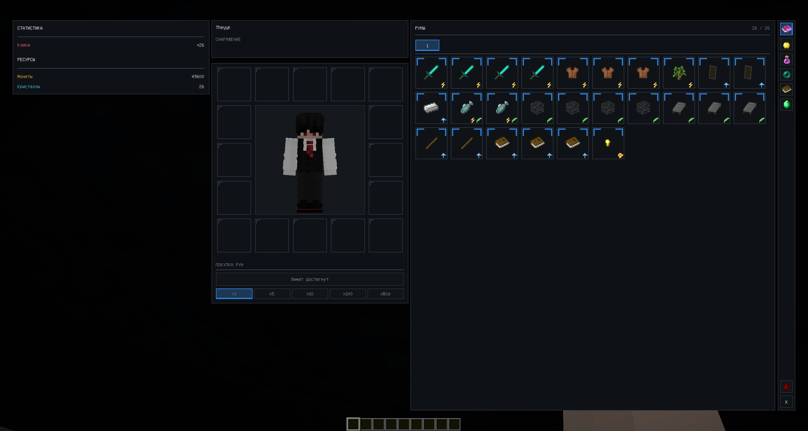
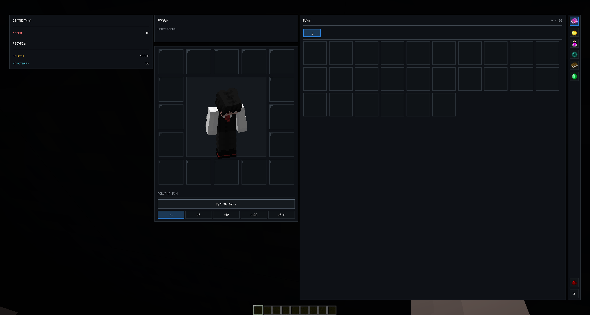
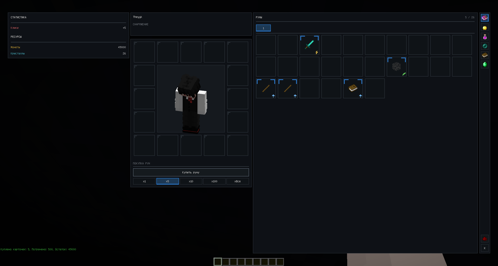
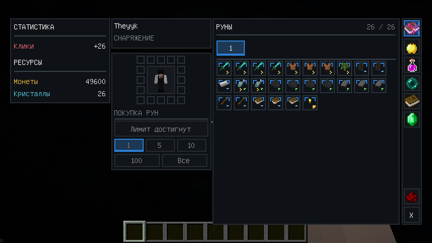

# Custom GUI Mod — Forge 1.12.2

Портфолио-проект игрового режима для Minecraft 1.12.2 с кастомным GUI, системой рун и стихий, кастомными мобами, ресурсами и хранением данных в MongoDB.

Проект построен на Forge Dedicated Server и использует единый клиент-серверный мод.

**Текущая версия: `v1.1.1`**

---

## 🎯 Что реализовано

- переработанный адаптивный GUI в стиле игрового инвентаря;
- система рун с **26 фиксированными позициями** для первой стихии;
- независимое состояние каждой позиции руны;
- типы рун и компактные визуальные бейджи;
- ранги рун с отдельным оформлением углов слота;
- переключение стихий через верхний селектор GUI;
- покупка рун `x1`, `x5`, `x10`, `x100`, `xВсе`;
- временный технический лимит покупки в 26 рун для текущей коллекции;
- блоки статистики и ресурсов игрока;
- предпросмотр персонажа и каркас будущей системы снаряжения;
- правая навигационная панель с активной вкладкой рун и заготовками будущих разделов;
- бонус урона от сохранённых рун/карточек;
- постоянный HUD: монеты, кристаллы и общий бонус урона;
- кастомные Zombie и Skeleton;
- собственные HP-полоски над мобами;
- разные ресурсы-награды для разных мобов;
- создание пользовательских ресурсов через команды;
- быстрое возрождение кастомных мобов;
- отключение ванильного дропа;
- защита кастомных мобов от внешних источников урона;
- MongoDB-хранение игроков, стихий/колод, рун/карточек, мобов и ресурсов;
- Tab-автодополнение команд с фильтрацией по введённому префиксу;
- регрессионные тесты для каталога рун и инвентаря.

---

## 🛠️ Технологический стек

| Компонент | Технология |
|---|---|
| Язык | Java 8 |
| Minecraft | 1.12.2 |
| Forge | 14.23.5.2859 |
| Gradle | 7.6.4 |
| ForgeGradle | 5.1.73 |
| MongoDB | 5.0.34 |
| MongoDB Driver | 4.5.1 |
| Сеть | `SimpleNetworkWrapper` |

---

## ✨ Руны и GUI

GUI открывается клавишей `C`.

В `v1.1.1` интерфейс был перестроен вокруг нового каркаса:

- слева находятся компактные блоки **Статистика** и **Ресурсы**;
- по центру отображается персонаж и каркас будущей системы снаряжения;
- справа находится инвентарь рун;
- над рунами расположен селектор стихий;
- крайняя правая панель зарезервирована под разные разделы интерфейса.

Первая стихия содержит **26 фиксированных позиций**. Каждая позиция представляет отдельную руну и хранит собственное состояние независимо от других позиций, даже если у нескольких рун одинаковое название или тип.

Пустая позиция отображается только рамкой. После получения руны появляются временная Minecraft-иконка, оформление ранга и мини-бейдж типа в правом нижнем углу.

Текущие типы включают:

```text
Клик
Земля
Усиление
Ресурс
Клик / Земля
```

Для визуализации типов используются компактные символы: молния, лист, стрелка усиления, монета и комбинированный бейдж.



### Пустая стихия

До получения рун отображаются только фиксированные позиции без лишнего текста и иконок.



### Покупка рун

Покупка поддерживает режимы:

```text
x1
x5
x10
x100
xВсе
```

Полученные руны занимают свои заранее определённые позиции, а не случайные свободные ячейки.



В текущей реализации действует временный технический предел **26 покупок** для коллекции. При достижении предела кнопка покупки становится недоступной. Этот лимит не является финальной игровой механикой.

### Адаптивность

GUI масштабируется под разные размеры окна, сохраняя основную структуру и доступность элементов управления.



---

## 🌿 Стихии

Текущая серверная модель исторически использует термин «колода», однако пользовательский интерфейс постепенно переводится на концепцию **стихий**.

Игрок может иметь несколько сохранённых наборов. В GUI они отображаются горизонтальными вкладками над инвентарём рун.

На текущем этапе переключение по-прежнему использует существующую серверную механику активной колоды для совместимости. В дальнейшем стихии планируется развивать как самостоятельную игровую систему.

---

## ⚔️ Бонус урона

Существующая игровая механика сохраняет бонус урона от сохранённых карточек/рун.

Сервер суммирует сохранённые записи игрока и применяет бонус через Forge-событие урона.

Кастомные мобы не используют ванильную броню, поэтому итоговый урон соответствует серверному расчёту.

В новом GUI строка `Клики` пока использует существующее значение общего бонуса урона как временный показатель. Отдельная полноценная статистика кликов и типов урона запланирована на дальнейшие версии.

---

## 📊 HUD игрока

В верхней части экрана вне основного GUI постоянно отображаются:

```text
Монеты | Кристаллы | Урон
```

HUD обновляется сервером после изменения игровых данных.

---

## 👾 Кастомные мобы

Поддерживаются:

- Zombie;
- Skeleton.

Для каждого моба настраиваются:

- имя;
- ресурс награды;
- количество ресурса;
- максимальное HP;
- тип;
- точка спавна.

Мобы:

- не используют AI;
- не перемещаются;
- имеют фиксированную точку спавна;
- быстро возрождаются после смерти;
- не выбрасывают ванильный дроп;
- защищены от лавы, огня, TNT и других внешних источников урона;
- получают урон от игрока.

Над каждым мобом отображаются имя, текущее HP, максимальное HP и награда.


---

## 💎 Система ресурсов

Встроенные ресурсы:

```text
coins
crystals
lightnings
```

Дополнительные ресурсы можно создавать через `/customresource`.

Каждому кастомному мобу при создании назначается конкретный ресурс и его количество. Например, один моб может выдавать монеты, а другой — кристаллы.

Для старых мобов без сохранённого поля ресурса используется совместимость с прежней монетной наградой.

---

## 💻 Команды

Названия некоторых команд пока сохраняют старую терминологию для обратной совместимости.

### Мобы

```text
/custommob create <name> <resource> <amount> <hp> <type>
/custommob setspawn <name>
/custommob unspawn <name>
/custommob delete <name>
/custommob list
```

Поддерживаемые типы мобов:

```text
zombie
skeleton
```

### Ресурсы

```text
/customresource create <name>
/customresource delete <resource>
/customresource list
/customresource balance <resource>
```

### Стихии / legacy-колоды

```text
/customdeck create <name>
/customdeck switch <index>
/customdeck list
/customdeck delete <index>
```

Индексы начинаются с `0`.

### Руны / legacy-карточки

```text
/customcards clear
```

Для пользовательских команд реализовано Tab-автодополнение с учётом уже введённого префикса. Например:

```text
/custommob c<Tab>
```

предлагает `create`, а не перебирает команды с начала списка.

Для аргументов используются доступные значения там, где они известны: ресурсы, имена мобов, индексы колод и типы мобов.

---

## 🗄️ MongoDB

Используется база:

```text
cristalix_demo
```

Основные коллекции:

```text
players
custom_mobs
custom_resources
```

### players

Хранятся:

- UUID игрока;
- монеты;
- кристаллы;
- молнии;
- пользовательские ресурсы;
- активная legacy-колода;
- список колод/стихий;
- записи рун/карточек каждой коллекции.

### custom_mobs

Хранятся:

- имя;
- тип;
- HP;
- ресурс награды;
- количество награды;
- координаты;
- состояние точки спавна.

---

## 🌐 Клиент и сервер

```text
Forge Client
      ↕
SimpleNetworkWrapper
      ↕
Forge Dedicated Server
      ↕
MongoDB
```

Клиент отвечает в основном за GUI, HUD, рендер и ввод игрока.

Сервер является источником истины для баланса, рун/карточек, стихий/колод, ресурсов, мобов, наград и расчёта урона.

---

## 🧪 Тесты

В проект добавлены регрессионные тесты для новой структуры рун.

Они проверяют, в частности:

- каталог из 26 фиксированных позиций;
- сохранение порядка каталога;
- независимость одинаковых рун в разных позициях;
- ранги отдельных позиций;
- соответствие временных иконок;
- текущий лимит покупки;
- совместимость со старыми записями.

Тесты входят в `check` через задачу `runeInventoryRegression`.

---

## 🚀 Сборка

```bash
./gradlew clean build
```

JAR создаётся в:

```text
build/libs/customguimod-1.1.1.jar
```

Клиент и сервер должны использовать одинаковую версию мода.

---

## 📦 Версии

### v1.0.0

Первая публичная рабочая версия:

- кастомный GUI;
- карточки;
- базовые кастомные мобы;
- MongoDB;
- баланс и награды;
- клиент-серверный сетевой протокол.

### v1.0.1

- несколько колод;
- отдельное хранение карточек по колодам;
- бонус урона от карточек всех колод;
- исправление HP-полоски;
- отключение ванильного дропа;
- исправление дублирования мобов после рестартов;
- улучшение рендера кастомных мобов.

### v1.0.2

- переключение колод из GUI;
- улучшение управления активной колодой.

### v1.0.3

- массовая покупка карточек `x1/x5/x10/x100/xВсе`;
- корректная покупка с учётом баланса и свободных слотов.

### v1.0.4

- постоянный HUD `Монеты | Кристаллы | Урон`;
- обновление GUI карточек;
- синхронизация статистики игрока с сервером.

### v1.1.0

#### Добавлено

- настраиваемые ресурсы наград для мобов;
- команды управления кастомными ресурсами;
- возможность назначать отдельный ресурс награды каждому мобу;
- улучшенное Tab-автодополнение для кастомных команд;
- автодополнение с учётом уже введённого префикса;
- отображение ресурса и его количества над кастомными мобами.

#### Исправлено

- убрана ванильная броня у кастомных мобов;
- урон по кастомным мобам корректно учитывает бонус урона от карточек.

#### Прочее

- добавлена обратная совместимость со старыми мобами, использующими награду в монетах;
- расширена структура MongoDB для кастомных ресурсов;
- обновлены скриншоты и документация проекта.

### v1.1.1

#### GUI

- полностью переработан каркас интерфейса;
- добавлена адаптивная компоновка для разных размеров окна;
- добавлены отдельные панели статистики, ресурсов, персонажа, рун и навигации;
- исправлено освещение модели игрока в GUI;
- добавлена вертикальная панель будущих разделов.

#### Руны и стихии

- пользовательская терминология переведена с карточек/колод на руны/стихии в новом GUI;
- первая стихия получила каталог из 26 фиксированных позиций;
- каждая позиция хранит независимое состояние;
- добавлены временные Minecraft-иконки;
- добавлены компактные бейджи типов рун;
- добавлено оформление рангов;
- пустые позиции больше не показывают лишнюю информацию;
- покупка первой стихии заполняет конкретные позиции каталога;
- введён временный предел в 26 рун с блокировкой покупки после достижения лимита.

#### Надёжность

- добавлена отдельная модель `RuneInventory`;
- добавлен каталог `EarthRuneCatalog`;
- сохранена совместимость со старыми записями;
- добавлены регрессионные тесты для новой структуры рун;
- обновлены актуальные скриншоты проекта.

---

## 📸 Скриншоты

В README используются актуальные скриншоты текущей версии. Дополнительные исторические изображения могут сохраняться в репозитории для демонстрации развития проекта.

---

## 📄 License

См. файл [LICENSE](LICENSE).
